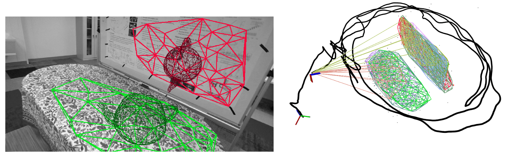

# Monocular Visual-Inertial Odometry with Planar Regularities 


[](https://www.youtube.com/watch?v=bec7LbYaOS8)

[](https://github.com/rpng/ov_plane/actions/workflows/build_ros1.yml)

This is a real-time monocular visual-inertial odometry (VIO) system leverage environmental **planes** within a multi-state constraint Kalman filter (MSCKF) framework.
At the core of our method is an efficient robust monocular-based plane detection algorithm which does not require additional sensing modalities such as a stereo, depth camera or neural network.
The project is built on top of [OpenVINS](https://github.com/rpng/open_vins) and thus shares similar tooling and architecture.
This plane detection and tracking algorithm enables real-time regularization of point features to environmental planes which are either maintained in the state vector as long-lived planes, or marginalized for efficiency.
Planar regularities are applied to both in-state SLAM and out-of-state MSCKF point features, enabling long-term point-to-plane loop-closures due to the large spacial volume of planes.

* Github project page - https://github.com/rpng/ov_plane
* Demonstration video - https://www.youtube.com/watch?v=bec7LbYaOS8
* Publication reference: https://chuchuchen.net/downloads/papers/Chen2023ICRA.pdf


## Installation and Building

You will need to ensure you have installed OpenCV 3 or 4, Eigen3, Ceres Solver, and a valid ROS 1 installation.
Please additionally refer to the OpenVINS [Installation Guide](https://docs.openvins.com/gs-installing.html) as dependencies are shared with it.
For Ubuntu linux-based system the system dependencies are (in addition to [ROS 1](https://docs.openvins.com/gs-installing.html#gs-install-ros-1)):

```bash
sudo apt-get install libeigen3-dev libboost-all-dev libceres-dev
```

We now setup a catkin workspace with both OpenVINS and the ov_plane project.
Specifically, we can clone both projects:

```bash
mkdir -p ~/workspace/catkin_ws_plane/src/
cd ~/workspace/catkin_ws_plane/src/
git clone https://github.com/rpng/open_vins/
git clone https://github.com/rpng/ov_plane/ 
cd open_vins/
git checkout 74a63cf758f595cc280f2165e5a6576e7ef8521d # last tested OpenVINS commit
cd ~/workspace/catkin_ws_plane/
catkin build
source devel/setup.bash 
```


## Running - Simulation

We extended the OpenVINS simulator to simulated environmental planes which contain environmental features.
A certain number of points are simulated as being planar and "free" non-planar per frame.
This simulator leverages a C++ implementation of our [lips](https://github.com/rpng/lips) simulator.

```bash
roslaunch ov_plane simulation.launch
```

To generate simulation results, one inspect the [results/run_simulation.sh](results/run_simulation.sh) script to reproduce the results of the paper.
To evaluate the results relative to the groundtruth please refer to [ov_eval](https://docs.openvins.com/namespaceov__eval.html) of OpenVINS.
The code has changed since publication to upgrade to the newest OpenVINS, but the results should still be representative.


## Running - Real-World Datasets

We support both the [The EuRoC MAV Dataset](https://projects.asl.ethz.ch/datasets/doku.php?id=kmavvisualinertialdatasets) and our released [RPNG AR Table Dataset](https://github.com/rpng/ar_table_dataset) datasets.
To run on either real-world dataset, use one of the following commands:

```bash
roslaunch ov_plane serial.launch config:=euroc_mav dataset:=V1_01_easy bag:=<path_to_bag>
roslaunch ov_plane serial.launch config:=rpng_plane dataset:=table_01  bag:=<path_to_bag>
```

Users can reproduce the results presented in our publication with the scripts provided in the [results/](results/) folder.
We additionally provide the script used to compute the evaluation, which are simple calls to [ov_eval](https://docs.openvins.com/namespaceov__eval.html) of OpenVINS.
The groundtruth "truths" files can be found in [ov_data](https://github.com/rpng/open_vins/tree/master/ov_data).
Please note the project has been updated since the time of publication and thus will cause slight variations in performance relative to the paper

```bash
./src/ov_plane/results/run_ros_eth.sh        # Euroc MAV
./src/ov_plane/results/run_ros_rpng_plane.sh # RPNG Indoor AR Table
./src/ov_plane/results/run_ros_tracking.sh   # Tracking statistics
```


## Acknowledgements

This project additionally leveraged the following wonderful libraries.
- [CDT](https://github.com/artem-ogre/CDT) - For generating Delaunay triangulations
- [ikd-tree](https://github.com/hku-mars/ikd-Tree) - For KNN searching without requiring ICP
- [tinyrender](https://github.com/ssloy/tinyrenderer) - For loading models for the AR demo


## Credit / Licensing

This code was written by the [Robot Perception and Navigation Group (RPNG)](https://sites.udel.edu/robot/) at the
University of Delaware. If you have any issues with the code please open an issue on our github page with relevant
implementation details and references. For researchers that have leveraged or compared to this work, please cite the
following:


```bibtex
@Conference{Chen2023ICRA,
  Title      = {Monocular Visual-Inertial Odometry with Planar Regularities},
  Author     = {Chuchu Chen and Patrick Geneva and Yuxiang Peng and Woosik Lee and Guoquan Huang},
  Booktitle  = {Proc. of the IEEE International Conference on Robotics and Automation},
  Year       = {2023},
  Address    = {London, UK},
  Url        = {\url{https://github.com/rpng/ov_plane}}
}
```

```bibtex
@Conference{Geneva2020ICRA,
  Title      = {{OpenVINS}: A Research Platform for Visual-Inertial Estimation},
  Author     = {Patrick Geneva and Kevin Eckenhoff and Woosik Lee and Yulin Yang and Guoquan Huang},
  Booktitle  = {Proc. of the IEEE International Conference on Robotics and Automation},
  Year       = {2020},
  Address    = {Paris, France},
  Url        = {\url{https://github.com/rpng/open_vins}}
}
```

The codebase and documentation is licensed under the [GNU General Public License v3 (GPL-3)](https://www.gnu.org/licenses/gpl-3.0.txt).
You must preserve the copyright and license notices in your derivative work and make available the complete source code with modifications under the same license ([see this](https://choosealicense.com/licenses/gpl-3.0/); this is not legal advice).


